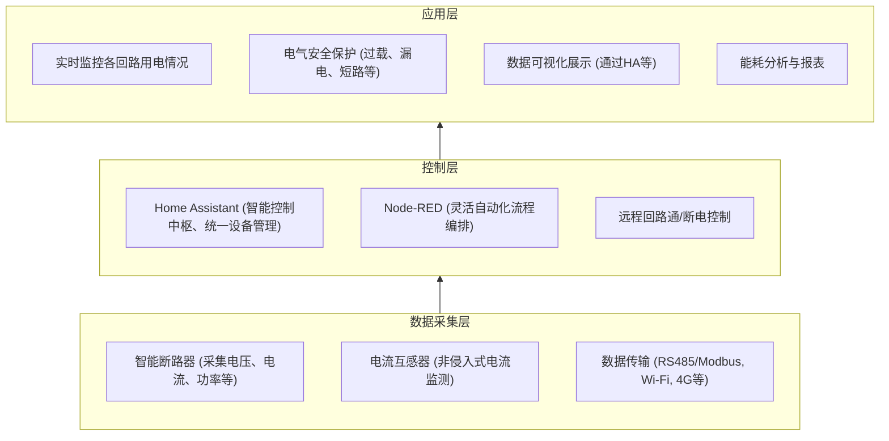

import { Steps } from 'rspress/theme';
import { Tab, Tabs } from 'rspress/theme';

# 民用建筑与办公空间的智能管理

*打造经济实用的能源“管家”*

在小型商业空间或现代家庭办公环境中，如何经济高效地管理能源，同时确保用电安全，往往是大家关心的问题。传统的能源管理方式可能意味着较高的成本，或者缺乏灵活性和智能化的手段。

本项目将向你展示一种不同的思路：如何巧妙融合NodeRED开源物联网平台、Home Assistant（HA）智能家居平台的灵活性，以及RS485/Modbus工业设备与智能家居设备的广泛适用性，来搭建一套既实用又易于扩展的能源管理方案。我们旨在通过实时用电监控、便捷的远程控制、增强的电气安全以及直观的数据可视化，为这类环境提供一个高性价比的能源管理实践参考。

**这个方案适合你吗？**

如果你正寻求一个注重成本效益，并期望实现以下具体目标的能源管理方案，那么本项目的经验或许能为你带来启发：

| 试点目标                                                     | 关联应用场景说明                                             |
| :----------------------------------------------------------- | :----------------------------------------------------------- |
| ✅ **了解用电去向，挖掘节能潜力** (例如：监控茶水间、公共设备区的具体能耗) | ✅ 帮助你清晰掌握各功能区域或关键设备的用能状况，为节能提供依据。  |
| ✅ **提升用电安全，防范潜在风险** (利用智能断路器的过载/漏电/短路保护) | ✅ 为你的办公或居住场所增加一道电气安全屏障，预防火灾等意外。 |
| ✅ **随时随地掌控电路通断** (特定回路的远程通/断电)            | ✅ 方便进行远程设备管理，如节假日一键关闭非必要回路，省心省力。 |
| ✅ **让数据说话，辅助决策与管理** (展示实时功率、历史用电量)    | ✅ 为能源审计、成本分摊（如共享办公）或优化用电习惯提供数据支持。 |
| 🕒 **[展望未来] 实现自动化管理** (如基于时间、人员活动、能耗阈值的自动通断电) | 🕒 迈向更智能、无需过多干预的能源管理，进一步提升节能效果和使用体验。 |

**需要说明的是，本方案的侧重点：**

为了确保方案的经济性和易用性，本项目在当前阶段并未追求极致的工业级精度或瞬时响应：

- ❌ **并非追求极高精度的工业级计量。** (更侧重趋势分析和日常管理)
- ❌ **对电路/设备的控制响应并非毫秒级。** (满足日常远程控制和自动化需求)

## 系统架构总览

为了实现上述能源管理目标，我们设计了一套分层清晰、职责明确的系统架构。该架构自下而上分为数据采集层、控制层和应用层，确保了数据的有序流动和功能的有效实现。

<Tabs>
<Tab label="数据采集层">

- 通过智能断路器采集电路的实时用电数据(电压、电流、功率等)。
- 使用电流互感器进行非侵入式的电流监测。
- 支持RS485/Modbus（工业常用）、Wi-Fi（智能家居常用）、4G等多种数据传输方式，确保设备接入的广泛性。

</Tab>
<Tab label="控制层">

- **Home Assistant** 作为用户交互界面、设备集成平台和基础自动化引擎。
- **Node-RED** 提供更强大、灵活的图形化流程编排能力，用于处理复杂逻辑和数据转换，是 HA 的有力补充。
- 支持对特定回路进行远程通/断电控制，为无人化管理打下基础。
- 可通过 MQTT、API 等方式灵活扩展，对接其他物联网平台和云服务。

</Tab>
<Tab label="应用层">

- 实时监控各回路用电数据和电气安全状态。
- 通过 Home Assistant 实现直观的数据可视化展示（仪表盘、图表）。
- 生成能耗分析报表，辅助制定节能策略和进行成本控制。
- 支持基于时间、人员活动、能耗阈值等多种条件的场景自动化。

</Tab>
</Tabs>

本方案的核心驱动力来自于两大成熟的开源平台：

- **[Home Assistant](scenarios/glossary/home-assistant) (HA)：** 作为智能家居领域的佼佼者，HA在本项目中承担了“智能控制中枢”的角色。它负责统一接入和管理各类硬件设备，提供直观的用户交互界面（Web UI及移动APP），存储历史数据，并能执行基础的自动化逻辑。其庞大的社区和丰富的集成插件是其巨大优势。
- **Node-RED：** 是一款强大的图形化流程编排工具。当HA的基础自动化功能不足以应对复杂的判断逻辑、数据转换或多系统联动时，Node-RED便能大显身手。通过拖拽节点、连接流程线的方式，用户可以灵活构建出强大的自动化工作流，极大地增强了系统的“智能”程度。

**数据通路：多协议融合的通信网络**

为了连接物理世界的设备与数字化的控制平台，本项目支持并整合了多种通信方式：

- **MQTT：** 轻量级的发布/订阅消息协议，非常适合物联网场景。智能网关常将Modbus等数据转换为MQTT格式，供Home Assistant或Node-RED订阅。
- **以太网 (TCP/IP)：** Home Assistant主机、智能网关等核心组件通常通过有线网络连接，确保数据传输的稳定性和速率。
- **Wi-Fi (TCP/IP)：** 智能家居设备（如基于ESPHome的电流互感器方案）常用的无线接入方式，部署便捷。
- **RS485/Modbus RTU：** 这是工业领域广泛采用的串行通信协议，许多智能电表、智能断路器等设备均支持此协议，具有稳定可靠的特点。
- **LoRaWAN / Meshtastic (LoRa)：** 适用于远距离、低功耗、小数据量传输的场景。例如，在一些布线困难或没有Wi-Fi覆盖的区域部署传感器，或构建去中心化的设备通信网络。这为特定环境下的数据采集提供了额外的灵活性。

通过这些协议的组合应用，我们确保了不同类型、不同来源的数据都能顺畅地汇入系统，并被有效处理和利用。

## 试点项目核心硬件选型参考 \{#core-hardware-reference}

为了将上述设计蓝图付诸实践，我们选择了一系列兼具性能、开放性与成本效益的硬件组件。以下是我们在此次民用建筑楼宇能源管理试点项目中采用的核心设备清单，**旨在为大家提供一个具体可操作的参考范例。**

| 设备名称                     | 核心功能                                                                 | 配套/依赖设备                                                        | 预装/核心软件                                                                    | 参考链接 (示例)                                                                                                                                                              |
| :--------------------------- | :----------------------------------------------------------------------- | :------------------------------------------------------------------- | :------------------------------------------------------------------------------- | :--------------------------------------------------------------------------------------------------------------------------------------------------------------------------- |
| **Home Assistant Green** | HA 控制网关，承载整个系统的智能逻辑、自动化规则及用户交互界面。                  | 路由器/交换机、网线                                                  | 预装 Home Assistant OS                                                           | [Home Assistant Green - Seeed Studio](https://www.seeedstudio.com/Home-Assistant-Green-p-5792.html)                                                                         |
| **reComputer R1000 (服务器端)** | 作为 Node-RED 服务器，LoRaWAN网络服务器 (LNS)，**Meshtastic消息接收节点**，数据存储等多个后台服务的集成平台。 | LoRaWAN 网关模组 (如适用), **Meshtastic LoRa 模组**, 以太网连接           | 预装 Linux, Docker, Node-RED, ChirpStack (LoRaWAN Server 示例), **Meshtastic** 等 | [reComputer R Series - Seeed Studio Wiki](https://wiki.seeedstudio.com/recomputer_r/)                                                                                      |
| **reComputer R1000 (端侧网关)** | 用于端侧设备的数据链路聚合、边缘计算、协议转换和远程采集与控制，**可通过Meshtastic将数据推送至服务器端**。 | Meshtastic LoRa 模组, RS485 扩展模块, 传感器/执行器接口               | 预装 Linux, Node-RED (用于边缘逻辑), **Meshtastic (LoRa Mesh)**, Modbus 库等   | [reComputer R Series - Seeed Studio Wiki](https://wiki.seeedstudio.com/recomputer_r/)                                                                                      |
| **智能断路器** | 对目标回路进行远程通/断控制；提供过载、漏电、短路保护；实时计量回路的功耗、电压、电流等参数。 | 智能网关 或 reComputer R1000 (端侧网关) 的RS485接口                    | 设备内置固件 (通常支持Modbus RTU)                                                | *[根据你实际选用的品牌和型号填写，或留空/写“市售常见型号”]*                                                                                                                     |
| **智能网关 (通用型)** | **桥梁角色**：当不使用reComputer作为端侧网关时，用于采集智能断路器的RS485/Modbus数据，并通过以太网/4G/Wi-Fi将数据转换为MQTT等协议上传。 | 4G物联网卡 (如需)、电源适配器、RS485通讯线                           | 设备内置固件，需支持Modbus转TCP/MQTT或其他HA可接入协议                         | *[根据你实际选用的品牌和型号填写，或留空/写“市售常见型号”]*                                                                                                                     |
| **电流互感器 (配合ESP模块)** | 在不改动现有强电线路的前提下，采集回路电流信息，实现非侵入式功耗计量。                   | Wi-Fi模块 (如ESP8266/ESP32), 220V 电源                                | 需刷写ESPHome固件                                                                | 1. [Non-invasive AC Current Sensor - Seeed Studio](https://www.seeedstudio.com/Non-invasive-AC-Current-Sensor-5A-ma-p-2051.html)   2. [XIAO 2-Channel Wi-Fi AC Energy Meter Bundle Kit](https://www.seeedstudio.com/XIAO-2-Channel-Wi-Fi-AC-Energy-Meter-Bundle-Kit.html) |

## 项目实施步骤

本章节将介绍搭建此能源管理试点项目的实施步骤。这些步骤提供了一个通用框架，并以本项目中实际使用的硬件（详见上一章节[本试点项目核心硬件选型参考](#core-hardware-reference)）为例进行说明，旨在帮助理解具体实施过程。

### 配件清单

| 配件名称               | 在本项目中的功能                                                              | 配套/依赖                                    |
| :--------------------- | :-------------------------------------------------------------------------- | :------------------------------------------- |
| **交换机/路由器** | 为 Home Assistant 主机、智能网关等提供稳定可靠的有线网络连接                    | 网线                                         |
| **插线板 / USB-C供电坞** | 为各设备提供集中的电源插座和必要的USB供电                               | 双头Type-C线 (部分设备可能需要)                  |
| **网线** | 用于 Home Assistant 主机与路由器、智能网关与路由器的以太网连接                          |                                              |
| **RS485通讯线** | （双绞屏蔽线为佳）连接智能断路器至智能网关，进行Modbus RTU等协议通讯               |                                              |
| **电源适配器** | 为不直接使用USB供电的设备（如智能网关、部分迷你主机）提供符合规格的直流电源             |                                              |
| **导轨开关电源** | （若设备安装于标准电箱内）为智能网关、HA主机等提供稳定的导轨式直流电源 (220V转12V/5V) | 电源线                                       |
| **空气开关 (保护电路)** | 在试点回路前端安装一个独立的普通空气开关，作为整个试点系统的上级保护            |                                              |

{/* 最好是有一个图，展示所有组件的连接 */}

>[!WARNING]
> **电气安全是首要前提！**
> 强电设备的安装、接线及改造工作**必须由具备资质的专业电工执行**，严格遵守当地电气安全规范。非专业人士切勿自行操作，以免发生危险。操作前务必确认断电并采取安全防护。

### 阶段一：规划与准备 \{#phase-1-planning-and-preparation}

<Steps>

### 明确核心需求与范围

确定监控的区域或设备类型，定义期望的管理目标（如数据监测、远程控制、自动化节能），并明确数据精度与实时性要求。

- 你希望监控哪些区域或哪些类型的用电设备？（例如：特定楼层、公共区域空调、办公区照明、大功率设备等）
- 你希望达到什么样的管理目标？（例如：仅数据监测与分析、需要远程通断控制、期望实现自动化节能等）
- 对数据精度和实时性有何要求？

### 评估设施与环境

勘察待改造区域的电气线路、设备安装空间及现有网络覆盖（有线、Wi-Fi、是否需考虑4G/LoRa等）。评估新增设备的供电需求与便利性。

- 待改造区域的现有电气线路布局如何？是否有合适的空间安装新设备（如电箱、网关）？
- 网络覆盖情况如何？（有线网络、Wi-Fi覆盖范围和信号强度，是否需要考虑4G或LoRa等远距离通信方案？）
- 是否有合适的**电源插座**为新增的控制设备和网关供电？根据设备数量，可能需要用到**插线板**或**USB-C供电坞**。

### 初步技术路径与设备选型

参照“核心硬件选型参考”中的示例，结合实际需求与环境，初步选定中央控制单元（如HA主机）、服务平台（如Node-RED服务器）、数据采集设备及边缘网关的类型。

- 根据需求和环境，结合“本试点项目核心硬件选型参考”章节中的设备示例，初步确定所需设备类型。例如：
    - **中央控制单元：** 如 Home Assistant Green，负责整体的智能控制和用户交互。
    - **Node-RED 及后台服务平台：** 如 reComputer R1000 (服务器端)，用于运行 Node-RED、LoRaWAN Server (如 ChirpStack)、Meshtastic 服务等。
    - **数据采集与边缘网关：**
        - 对于RS485设备（如智能断路器），可选用 reComputer R1000 (端侧网关) 或通用型智能网关进行数据采集和协议转换。
        - 对于非侵入式电流监测，可考虑电流互感器配合ESP模块（通过Wi-Fi接入ESPHome/HA）。
        - 若需远距离无线数据回传，可部署 reComputer R1000 (端侧网关) 并利用其 Meshtastic 功能。
- 思考这些设备之间的数据链路：Modbus -> TCP/MQTT，Wi-Fi -> MQTT/HA API，Meshtastic -> 服务器端 Meshtastic 服务等。

### 规划数据链路

简要梳理主要设备间的数据流向和通信协议，例如：RS485/Modbus设备如何通过网关转换为MQTT，Wi-Fi设备如何接入，Meshtastic或LoRaWAN设备如何回传数据。

### 绘制部署草图

在建筑平面图上标记关键设备（监控点、控制器、网关、主机）的预安装位置，并规划主要线缆（如网线、RS485通讯线）的大致走向，作为后续工作的依据。

- 在平面图上标记出主要监控点、控制设备安装位置、网关位置、核心控制单元位置以及大致的**网线**和**RS485通讯线**（建议选用双绞屏蔽线）走向。这有助于后续的设备清单制定和施工。

### [可选] 预算初步评估

根据选定的设备类型和所需配件，结合可能产生的专业施工费用及长期运维成本（如流量费），进行初步的成本估算。

- 根据初步的技术选型，以及所需的配件（参考“配件清单”），大致估算所需硬件成本、可能的施工成本（如需专业电工）和长期运维成本（如SIM卡流量费等）。

</Steps>

完成以上规划与准备工作，将为项目的顺利实施奠定基础。

### 阶段二：硬件安装与基础连接

此阶段的核心任务是将规划好的硬件设备安装到位并完成基础的物理连接。**再次重申：所有强电操作必须由持证专业电工进行。**

<Steps>

### 安装核心计量/控制设备

由专业电工将**智能断路器**、**智能电表**等设备规范接入指定回路的配电箱。若安装**电流互感器**，也需在确保安全的前提下由专业人士操作，并将配套的ESP模块固定。

### 部署中央控制单元

放置**Home Assistant主机**（如HA Green），通过**网线**连接至局域网的**交换机/路由器**，并接通电源。

### 安装服务器与网关设备

部署**Node-RED服务器及后台服务平台**（如reComputer R1000服务器端），确保其网络连接和供电。安装**边缘网关**（如reComputer R1000端侧或通用型智能网关），连接电源、网络，并根据需要连接**RS485通讯线**至Modbus设备或安装LoRa/Meshtastic天线。

### 构建与检查网络设施

确认**交换机/路由器**工作正常，为有线设备提供稳定连接。检查Wi-Fi覆盖区域的信号强度，确保无线设备能可靠接入。

### 初步通电与连接性验证

在专业电工确认所有电气连接安全无误后，为新安装设备通电。观察设备电源及网络状态指示灯是否正常，并可初步测试设备在局域网内的网络连通性（如ping IP地址）。

</Steps>

完成硬件的物理部署和基础连接后，系统便具备了“躯体”，等待软件注入“灵魂”。

---

### 阶段三：软件配置与系统集成

本阶段旨在配置各软件平台，打通数据链路，使硬件设备能够被系统识别、管理并与之交互。

<Steps>

### 配置Home Assistant (HA)

完成HA主机的初始设置（账户、区域等）。安装并配置核心“集成”，如MQTT（连接Broker）、ESPHome（接入ESP设备）、Modbus（连接Modbus TCP设备或网关）等。

### 配置Node-RED与后台服务

确保Node-RED服务（如在reComputer服务器端运行）正常启动。安装必要的Node-RED附加节点（如HA交互节点、MQTT、Modbus等）。若使用LoRaWAN或Meshtastic，需配置相应的网络服务器（如ChirpStack）或服务。

### 配置边缘网关

设置边缘网关（如reComputer端侧网关或通用型智能网关）以读取下级设备（如智能断路器）的数据。配置数据上报机制，如将Modbus数据转换为MQTT格式发布，或通过Meshtastic/LoRaWAN回传。

### 设备接入与实体化

在Home Assistant中检查并确保来自各数据源（MQTT、ESPHome、Modbus等）的设备已成功注册，并生成了对应的传感器、开关等“实体”。

### 验证数据流与控制通路

通过HA界面查看实体状态，确认传感器数据（如功率、电流）能正确显示。尝试通过HA控制开关类实体，验证物理设备（如智能断路器）是否响应。

### [建议] 创建初步监控仪表盘

在HA中创建一个简易仪表盘，添加关键传感器数据和控制开关，以便于实时监控和后续调试。

</Steps>

至此，软硬件已基本对接完毕，系统应能初步采集数据并执行控制。

### 阶段二：硬件安装与基础连接

在这一阶段，我们将把规划好的硬件设备实际安装到预定位置，并完成基础的物理连接。**再次强调，所有涉及强电的操作，特别是智能断路器、电表等设备的接入，务必由持证专业电工执行，确保安全第一。**

**1. 核心计量与控制设备的安装（专业电工操作）：**
首先，由专业电工根据设计图纸，在选定的供电回路中安装核心的计量与控制设备。这通常涉及到在配电箱内的工作。
    *如果是安装**智能断路器**或**智能电表**，电工会将其接入目标电路，替代或串联在原有开关之后。若为试点项目新增了独立的控制箱，可能还需要预先安装一个**空气开关 (保护电路)** 作为整个试点系统的上级保护。
    - 对于**电流互感器 (配合ESP模块)** 这种非侵入式设备，虽然安装过程不直接改动强电线路，但在将其卡在带电的火线上时，同样需要专业人士在确保安全（如临时断电）的前提下操作，并将配套的ESP模块固定在附近合适位置。

**2. 控制单元与网关设备的部署：**
接下来，部署系统的“大脑”和“神经节点”——即中央控制单元、服务器以及各类网关设备。
    *将选定的**中央控制单元**（例如 Home Assistant Green）放置在规划好的位置，通过**网线**连接到办公室的**交换机或路由器**，并接通电源。
    - 类似地，部署用于运行Node-RED及后台服务（如LoRaWAN Server、Meshtastic服务）的**服务器平台**（例如 reComputer R1000 服务器端），确保其稳定的网络连接和供电。
    *安装**边缘网关**（例如 reComputer R1000 端侧网关或通用型智能网关）。这些设备通常需要：
        - 连接电源：根据设备类型和安装位置，可能使用**电源适配器**直连插座，或在电箱内通过**导轨开关电源**供电。
        *接入网络：通过**网线**连接至局域网，或根据设备能力配置其Wi-Fi或4G联网。
        - 连接下级设备：若是RS485类型的网关，需使用**RS485通讯线**（注意A/B线序和终端电阻的正确匹配）将其与智能断路器等Modbus设备连接起来。
        - 若设备使用LoRa或Meshtastic通信，确保其天线已正确安装，并置于信号良好的位置。

**3. 网络基础设施的构建与检查：**
确保所有需要联网的设备都能顺畅接入网络是本阶段的关键一环。
    *检查**交换机/路由器**的工作状态，确保有足够的可用端口，并且DHCP服务（如果使用）工作正常。
    - 对于通过Wi-Fi接入的设备（如ESP模块），确认其所在位置的Wi-Fi信号强度满足要求。
    - 所有有线连接的设备，如Home Assistant主机、reComputer、有线网关等，其**网线**连接应牢固可靠。

**4. 初步通电与基本连接性验证：**
在所有硬件安装和物理连接（特别是强电线路）经专业电工检查确认无误后，可以进行初步的通电测试。
    *逐个为新安装的设备通电，观察设备的电源指示灯和网络状态指示灯是否正常亮起。
    - 对于通过有线网络连接的设备，检查其网口指示灯是否显示正常的连接状态。
    - [可选] 如果你熟悉网络工具，可以在局域网内尝试ping一下新接入网络设备（如Home Assistant主机、reComputer等）的IP地址（通常可从路由器管理界面获取），以初步判断其网络连通性。

此阶段完成后，所有硬件应已各就各位并初步通电。下一步，我们将进入软件配置与系统集成的环节，让这些硬件真正地“活”起来并协同工作。

### 阶段三：软件配置与系统集成

在这一阶段，我们的目标是配置核心控制软件，打通各个硬件设备之间以及硬件与软件平台之间的数据链路，使整个系统能够协同工作，实现预期的监测与控制功能。

**1. 核心控制单元 (Home Assistant) 的基础配置与集成设置：**
首先，对作为系统大脑的Home Assistant主机（如Home Assistant Green）进行初始化配置。首次启动后，系统会引导你创建管理员账户、设置地理位置、单位制等基础信息。完成这些后，关键在于安装和配置与本项目相关的核心“集成 (Integrations)”，它们是连接外部设备和服务的桥梁：
    ***MQTT 集成：** 这是物联网项目中非常核心的通信协议。你需要在HA中配置MQTT集成，使其连接到MQTT Broker。Broker可以是在HA附加组件商店中安装的Mosquitto，也可以是部署在其他服务器（如本项目中的 reComputer R1000 服务器端）上的实例。
    - **ESPHome 集成：** 如果你使用了基于ESPHome固件的设备（例如前面提到的电流互感器配合ESP模块方案），HA通常能够自动发现并提示添加。添加后，ESPHome设备上的传感器和控制器会自动成为HA中的实体。
    ***Modbus 集成：** 若你的智能网关或边缘设备（如reComputer R1000端侧网关）将RS485 Modbus数据转换为Modbus TCP协议，或者HA需要直接轮询Modbus TCP设备，则需在HA中配置Modbus集成，指定目标设备的IP地址、端口以及需要读取的寄存器信息（如电压、电流、功率等）。
    - **其他设备集成：** 根据你选用的其他Wi-Fi智能设备或特定品牌的硬件，可能还需要安装相应的官方或社区集成。

**2. Node-RED 及后台服务平台的配置：**
对于运行Node-RED以及其他后台服务（如LoRaWAN网络服务器、Meshtastic服务）的平台（例如本项目中的 reComputer R1000 服务器端）：
    ***Node-RED 初始化：** 确保Node-RED服务已正常启动。首次访问Node-RED编辑器界面时，可能需要进行一些基本安全设置。关键是安装本项目所需的附加节点（Palettes），例如 `node-red-contrib-home-assistant-websocket` (用于与HA进行深度交互)、MQTT 输入/输出节点、Modbus节点（如果Node-RED直接处理Modbus通讯）以及处理特定数据格式（如JSON、XML）的节点。
    - **其他后台服务：** 如使用了ChirpStack作为LoRaWAN网络服务器，或部署了Meshtastic服务来接收来自端侧网关的消息，需确保这些服务已正确安装、配置并运行，网络端口已开放，且能够与相应的硬件（如LoRaWAN网关模组、Meshtastic LoRa模组）正常通信。

**3. 边缘网关与数据采集设备的配置：**
边缘网关（如 reComputer R1000 端侧网关或通用型智能网关）是连接现场传感设备与上层平台的关键。
    ***下行设备连接：** 配置网关的串行端口参数（如RS485的波特率、数据位、校验位、从站地址等），使其能够正确读取所连接的Modbus设备（如智能断路器）的数据。
    - **数据上报与协议转换：** 这是网关的核心功能。你需要配置网关将采集到的数据（例如从Modbus寄存器读取的数值）转换为统一的格式（通常是JSON），并通过指定的协议（最常用的是MQTT）上报给MQTT Broker。这涉及到定义清晰的MQTT 主题 (Topic) 结构和消息负载 (Payload) 格式，以便HA或Node-RED能够正确订阅和解析。
    ***Meshtastic/LoRaWAN 配置：** 如果边缘网关通过Meshtastic或LoRaWAN进行数据回传，需确保其LoRa参数配置正确，并已注册到对应的Meshtastic网络或LoRaWAN网络服务器 (LNS)。
    - **边缘逻辑 (可选)：** 如果边缘网关（如运行Node-RED的reComputer）具备边缘计算能力，可以在此层面部署一些初步的数据处理逻辑或简单的控制策略，以减轻云端或中央控制器的负担，或在网络中断时提供一定的自主运行能力。

**4. 设备实体化与数据流初步验证：**
完成上述配置后，理论上数据链路应已打通。此时，你需要在Home Assistant中检查来自各设备的数据是否已成功转化为可用的“实体 (Entities)”。
    *对于通过MQTT上报的数据，如果遵循了HA的MQTT Discovery规范，相关设备和实体可能会自动出现。否则，你可能需要在HA的配置文件 (`configuration.yaml`) 中手动定义MQTT传感器 (sensor)、开关 (switch) 等实体，指定它们订阅的MQTT主题和解析方式。
    - ESPHome设备接入后，其定义的传感器和控制器应自动显示在HA的设备列表中。
    - 仔细检查HA中各实体的状态，确认能否看到从智能断路器上传的功率数据、从电流互感器采集的电流值等。尝试通过HA界面控制一个开关实体，看对应的物理设备（如智能断路器）是否响应动作。

**5. [建议] 创建初步的监控仪表盘：**
为了方便后续的调试和功能验证，建议在Home Assistant的Lovelace UI中创建一个简单的仪表盘。将关键的传感器实体（如实时功率、总用电量）和控制实体（如回路开关）添加到此仪表盘中，形成一个直观的监控与操作界面。

当你能够在这个初步的仪表盘上看到实时数据的跳动，并能通过点击按钮控制远端设备时，就意味着本阶段的核心任务已基本完成。系统“活”起来了，接下来就可以进行更全面的测试和自动化场景的搭建了。

## 场景搭建

## 主要功能实现与效果评估

本办公室智慧能源试点项目成功运行后，实现了以下预定目标和核心功能：

- ✅ **精确的回路用电监控：**
  - Home Assistant仪表盘能够实时、准确地显示目标回路的电压、电流、瞬时功率及累计用电量。
  - 可追溯历史数据，为分析特定时段（如工作时间、夜间待机）的用能模式提供了可靠依据。
- ✅ **便捷的远程回路控制：**
  - 项目团队成员可通过授权的Home Assistant手机App或Web界面，随时随地安全地控制目标回路的通断。
  - 成功演示了在非工作时间远程关闭选定回路，以消除不必要的待机能耗。
- ✅ **增强的回路电气安全：**
  - （依赖智能断路器自身功能）智能断路器为回路提供了过载、短路及漏电（如具备该功能）保护。
  - Home Assistant可配置在检测到断路器状态异常（如跳闸，需断路器支持状态反馈）时，通过系统发送告警通知。
- ✅ **直观的数据可视化界面：**
  - 定制化的仪表盘使得非技术背景的行政或管理人员也能轻松理解回路的用能状况。

## 项目实施经验与价值思考

- **真实环境验证的重要性：** 在实际办公环境中进行部署和测试，能更早发现理论设计阶段未曾考虑到的问题（如网络信号、设备兼容性、实际负载特性等）。
- **专业电气工作不可或缺：** 任何涉及强电的改造，安全永远是第一位的。专业电工的参与是项目顺利和安全实施的根本保障。
- **开放平台的强大潜力：** Home Assistant的开放性和灵活性使得集成不同品牌、不同协议的硬件成为可能，为构建定制化解决方案提供了坚实基础。
- **数据是优化的起点：** 通过本项目收集到的精确能耗数据，为未来制定更细致的节能策略、评估设备能效、优化办公用能习惯提供了可能。
- **示范与推广价值：** 本项目成功验证了方案的可行性，其经验和模式可为其他办公室乃至小型商业体实施类似的能效提升项目提供有价值的参考。

## 总结与未来展望

本次办公室智慧能源试点项目，不仅成功实现了对特定办公回路的智能化监控与控制，更重要的是，它验证了一套低成本、高灵活性、可扩展的智慧能源管理解决方案在真实场景下的应用价值。这为我们后续在更广泛的商业环境中推广此类方案积累了宝贵经验。

**未来基于此试点项目的扩展方向：**

- **深化自动化策略：** 结合更丰富的传感器数据（如光照、人员密度、日程表），开发更智能、更精细化的自动节能控制逻辑。
- **横向扩展监控范围：** 将更多办公区域或类型的负载接入系统，实现全面的办公能源管理。
- **探索与楼宇自控系统(BAS)的联动。**
- **持续优化用户体验，** 提供更简洁易用的报表和控制界面。
